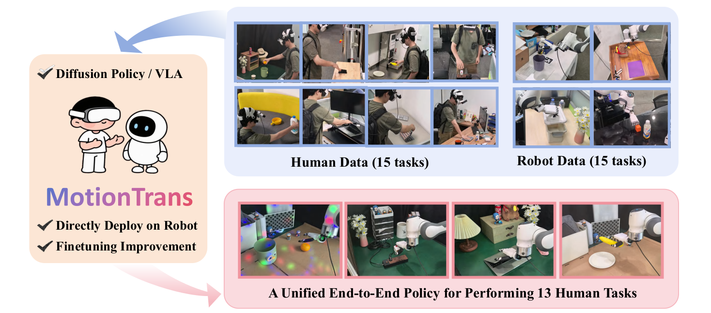
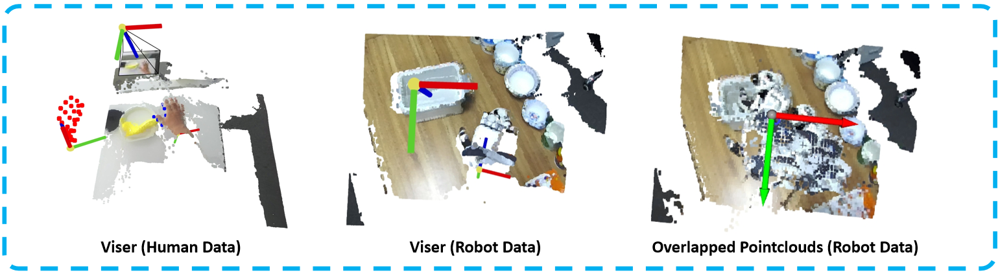

# MotionTrans: Human VR Data Enable Motion-Level Learning for Robotic Manipulation Policies

**[Chengbo Yuan](https://michaelyuancb.github.io/), [Rui Zhou](https://zhourui9813.github.io/)^, [Mengzhen Liu](https://scholar.google.com/citations?hl=zh-CN&user=AUVUNusAAAAJ)^, [Yingdong Hu](https://yingdong-hu.github.io/), [Shengjie Wang](https://shengjiewang-jason.github.io/), [Li Yi](), [Chuan Wen](https://alvinwen428.github.io/), [Shanghang Zhang](https://www.shanghangzhang.com/), [Yang Gao](https://yang-gao.weebly.com/)*.**

**[[Project Website](https://motiontrans.github.io/)] [[Arxiv]()] [[Dataset](https://huggingface.co/datasets/michaelyuanqwq/motiontrans)] [[BibTex](#jump)]**

^ Indicates equal contribution. * Corresponding author.



## Introduction

MotionTrans is the first framework that achieve explicit end-to-end human-to-robot motion transfer, established motion-level policy learning from human data. By cotraining on 15 robot tasks and 15 human tasks, we enable both [Diffusion Policy](https://github.com/real-stanford/diffusion_policy) and [Pi0-VLA](https://github.com/Physical-Intelligence/openpi) to directly perform 10+ human tasks. Here we open-source all codes of the framework, including 
 - (1) Robot teleoperation.
 - (2) Human data collection.
 - (3) MotionTrans Dataset.
 - (4) Human-robot data processing.
 - (5) Human data replay (on robot).
 - (6) Policy human-robot cotraining / finetuning.
 - (7) Checkpoints (Weights) of cotrained policy.
 - (8) Policy inference and deployment (on robot).

## TODO List

 - [ ] Update Paper and Bibtex to the final Arxiv version (before 10.1).
 - [ ] Release Full MotionTrans Dataset (before 10.8).
 - [ ] Release pretrained MotionTrans-DP checkpoints (before 10.8).
 - [ ] Release human data collection toolkit. (before 10.15).

## Installation

```
conda create -n dexmimic python=3.10    
codna activate dexmimic 
pip install -r requirments.txt
pip install torch torchvision peft open3d viser
pip install huggingface-hub==0.21.4 pin==3.3.1 numpy==1.24.4
```

Since we rely on ZED2 camera for visual observation, please also install the [ZED SDK](https://www.stereolabs.com/docs/app-development/python/install) following the official instruction.

## (1) Robot Teleoperation

Please following [documents/1.robot_teleoperation.md](./documents/1.robot_teleoperation.md)

## (2) Human Data Collection

Please following [documents/2.human_data_collection.md](./documents/2.human_data_collection.md)

## (3) MotionTrans Dataset

Please download the dataset from this huggingface link: [MotionTrans Dataset](https://huggingface.co/datasets/michaelyuanqwq/motiontrans). The details of the dataset can be found in [documents/3.motiontrans_dataset.md](./documents/3.motiontrans_dataset.md)

## (4) Human-Robot Data Processing

For data processing:

```
bash scripts_data/zarr_human_data_conversion_batch.sh
bash scripts_data/zarr_robot_data_conversion_batch.sh
```

This will process all tasks in the raw data folder and save the processed data in zarr format. For instruction augmentation (with OpenAI-GPT), check out `scripts/zarr_get_diverse_instruction.sh`. For data visualization, first run visualization-version processing scripts for a single task:

```
bash scripts_data/zarr_human_data_conversion_vis.sh
bash scripts_data/zarr_robot_data_conversion_vis.sh
```

And then run the visualization script (remember to update the `data_path` in the `.sh` file to the zarr folder generated before):

```
bash scripts_data/data_visualization.sh
```

This will open a window to visualize the overlapped pointclouds for checking and a interactive [viser](https://viser.studio/main/) visualization for detailed inspection. The visualization results are shown below:



## (5) Human Data Replay (on Robot)

To replay the processed human data on the robot, run:
```
bash scripts/replay.sh
```

And then follow the instruction in your terminal to control the replay process.

## (6) Policy Human-Robot Cotraining / Finetuning

We provide [Diffusion Policy](https://arxiv.org/abs/2303.04137) codebase in this repository. For [Pi0-VLA](https://arxiv.org/abs/2410.24164), please refer to the [MotionTrans-Pi0-VLA](https://github.com/michaelyuancb/motiontrans-pi0). 

For human-robot multi-task cotraining (zero-shot setting in the paper), run:
```
bash scripts/dp_base_cotraining.sh
```

The checkpoints will be saved in `.ckpt` file. Allow with the checkpoints, a `.yaml` recording (the order of) all training tasks will also be saved, which will be used for later policy inference and robot control.

**The cotrained checkpoints can be downloaded from [here]()**

For few-shot robot demonstrations finetuning (few-shot setting in the paper), run:
```
bash scripts/dp_base_finetune_5demo.sh
bash scripts/dp_base_finetune_20demo.sh
```

## (7) Policy Inference and Deployment (on Robot)

To deploy trained **Diffusion Policy (DP)** on the robot, run:
```
bash scripts/dp_infer.sh
```
and follow the instruction in your terminal to control the robot execution. We note that the parameters and tricks for action-chunk-based inference affect the performance a lot. Please refer to the comments in `scripts/dp_infer.sh` for parameter details. You should especially pay attention to `robot_action_horizon`, `robot_steps_per_inference`, `gripper_action_horizon`, and `gripper_steps_per_inference`, which should be set carefully to get a balance between inference horizon and action jittering (mode discussion and potential improvement could refer to blog of [Real-Time Action Chunking](https://www.physicalintelligence.company/research/real_time_chunking)). Current parameter is optimized for our setup, and you may need to tune it for your own setup.

To deploy trained **Pi0-VLA** on the robot, first start the policy client (refer to [MotionTrans-Pi0-VLA](https://github.com/michaelyuancb/motiontrans-pi0)), and then run:
```
bash scripts/pi0_infer.sh
```
and follow the instruction in your terminal to control the robot execution. The scripts above start a server to communicate with the policy client, and then control the robot execution. More details could refer to [official Pi0-VLA repository](https://github.com/Physical-Intelligence/openpi).

## Acknowledgment

This repository is based on the code from [Data-Scaling-Laws](https://github.com/Fanqi-Lin/Data-Scaling-Laws), [UMI](https://github.com/real-stanford/universal_manipulation_interface), [Open-Television](https://github.com/OpenTeleVision/TeleVision), [ARCap](https://github.com/Ericcsr/ARCap), [OpenPi](https://github.com/Physical-Intelligence/openpi), [Viser](https://github.com/nerfstudio-project/viser), [RoboEngine](https://github.com/michaelyuancb/roboengine), [EgoHOI](https://github.com/michaelyuancb/ego_hoi_model), [DROID](https://github.com/droid-dataset/droid) and [Pinocchio](https://github.com/stack-of-tasks/pinocchio). We sincerely appreciate their contribution to the open-source community, which have significantly supported this project. We also sincerely thank our AI-collaborators [ChatGPT](https://openai.com/chatgpt), [Kimi](https://www.kimi.com/) and [Github Copilot](https://github.com/features/copilot) !!

## Citation

If you find this repository useful, please kindly acknowledge our work <span id="jump">:</span>
```tex
@inproceedings{yuanmotiontrans,
  title={MotionTrans: Human VR Data Enable Motion-Level Learning for Robotic Manipulation Policies},
  author={Yuan, Chengbo and Zhou, Rui and Liu, Mengzhen and Hu, Yingdong and Wang, Shengjie and Yi, Li and Zhang, Shanghang and Wen, Chuan and Gao, Yang},
  booktitle={Human to Robot: Workshop on Sensorizing, Modeling, and Learning from Humans}
}
```