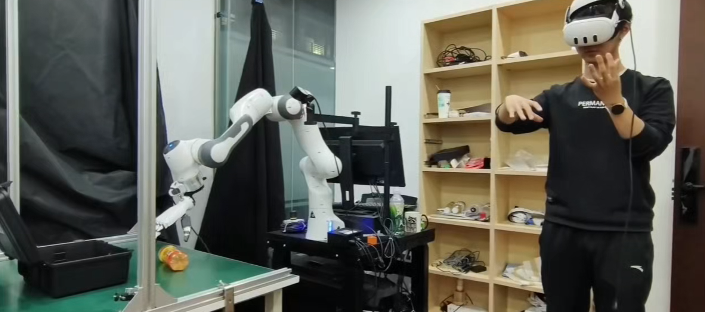
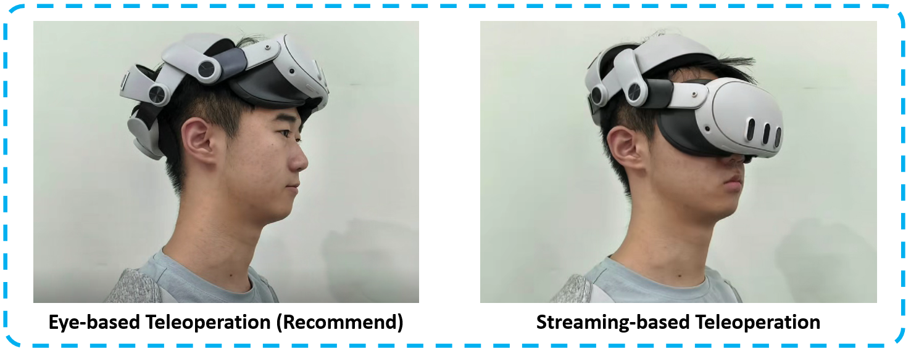
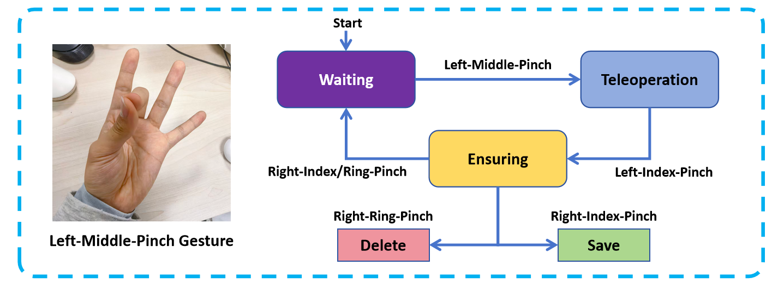

# MotionTrans: Robot Teleoperation



An example video is available at ``assets/media/examples/teleoperation.mp4``

## Step0: Robot Hardware Setup

Hardware List:
 - Franka Emika Panda Robot
 - (Right) Inspire Hand RH56DFXC
 - ZED2 Camera
 - Quest 3 / 3S VR Headset
 - PC (for running the teleoperation system)
 - NUC (for running the [Franka Polymetis](https://github.com/facebookresearch/fairo) controller)

First, connect the ZED Camera, VR Headset, and Inspire Hand to the PC. Then connect the NUC, Franka Robot, and PC following the [Meta Polymetis documentation](https://facebookresearch.github.io/fairo/polymetis/). Finally, we connect the [Inspire Hand RH56DFXC](https://en.inspire-robots.com/product/rh56dfxc) to the Franka Panda robot using a self-designed adaptor, which can be found in ``assets/inspire_franka_wrist_connect.STL``. The transformation from the Franka end-effector to the base of Inspire Hand is provided in ``assets/franka_eef_to_wrist_robot_base.npy``, which is generated by running:  
```
python -m scripts_data.get_eef_wrist_transformation
```

## Step1: Configuration Setup

Modify the configuration in ``config/franka_inspire_atv_cam_unimanual.yaml`` to match your setup. The important parameters include:
- `device_id` (cameras): the device ID of your Zed camera.
- `calib_cam_to_base` (cameras): the transformation from the camera to the robot base. You can use a hand-eye calibration method to obtain this matrix, e.g., [DROID calibration toolkit](https://github.com/droid-dataset/droid).
- `joints_init` (robots): the initial joint position of the Franka Panda robot. You can set it to a comfortable pose for teleoperation. Pay attention to **safety** i.e. avoid self-collision and collisions with the table!
- `gripper_port` (grippers): the serial port of the Inspire Hand.

Our controller also enables bimanual teleoperation in theory. This could be achieved by adding more hardware in the configuration and writing a new teleoperation interface in the future.

## Step2: Franka Control


The control of the Franka Emika robot is based on [Meta Polymetis](https://github.com/facebookresearch/fairo). Please follow the [official documentation](https://facebookresearch.github.io/fairo/polymetis/) for hardware setup and installation. After that, clone this repository on the NUC and run:

```
conda activate polymetis
launch_robot.py robot_client=franka_hardware
```

and 
```
conda activate polymetis
cd scripts
python franka_nuc_server.py
```

on two bash terminals: the first command starts the Polymetis controller on the NUC, and the second command starts a server to receive the control commands from the PC and send them to the NUC Polymetis controller.


## Step3: Inspire Hand Control

Run the following command on the PC:

```
sudo chmod 666 /dev/ttyUSB0
```

This command grants permission to access the Inspire Hand serial port.


## Step4: Connect to VR Headset

We build our teleoperation system based on [Open-Television](https://github.com/OpenTeleVision/TeleVision). Please connect your VR headset to the PC and follow [Open-Television](https://github.com/OpenTeleVision/TeleVision/issues/12#issue-2401541144) to set up the Quest 3 VR device.

After that, run
```
adb reverse tcp:8012 tcp:8012
```

to enable the real-time streaming between the PC and Quest 3. If the port is occupied, use ``lsof -i :8012`` to find the process and kill it. After that, visiting `http://127.0.0.1:8012/` in the browser of VR, and type `Enter VR` to enter the VR mode.

## Step5: Start to Teleoperate Your Robot !

As shown in Open-Television, you can see the camera view in VR in real time. This is useful when teleoperating the robot in a remote environment. However, we recommend directly using human eye vision to teleoperate the robot (as shown in the figure below), which allows for more precise control.




Run the following command on the PC to start the teleoperation system:

```
bash scripts/teleop_unimanual_frankainspire.sh
```
You can adjust the camera exposure, data saving path, and other parameters in the bash script.


## Step6: The Loop of Teleoperation 

After starting the system in bash, it enters the Waiting State. We can use hand gestures to control the loop as follows:



- **(1) [Waiting State]**: The robot will not follow your movements. You should **adjust your right hand to match the current robot state** to prepare for teleoperation.  
- **(2) [Teleoperation State]**: The robot hardware will follow your right-hand movements. **Do not move your right hand too quickly**, as this may cause safety issues.  
- **(3) [Ensuring State]**: The robot will not follow your movements. You can use gestures to choose whether to save or delete the data just collected.  


## Step7: The Format of Robot Data

The collected data will be saved in the path specified in the bash script. The data format is as follows:

```
├── videos
│   ├── rgb.mp4             # a video for data checking
│   ├── recording.svo2      # the visual data
├── episode_config.yaml     # the configuration of this episode
├── episode.pkl             # the robot state data
```

We recommend naming the folder for each task as `robot_{env_type}_{task_description}`, where `{task_description}` is a short description of the task with all blank spaces replaced by underscores. For example, `pick_up_the_apple`.


