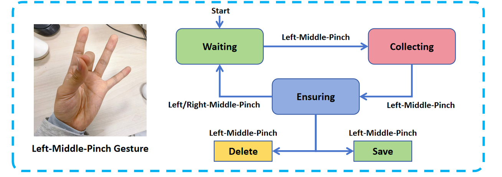
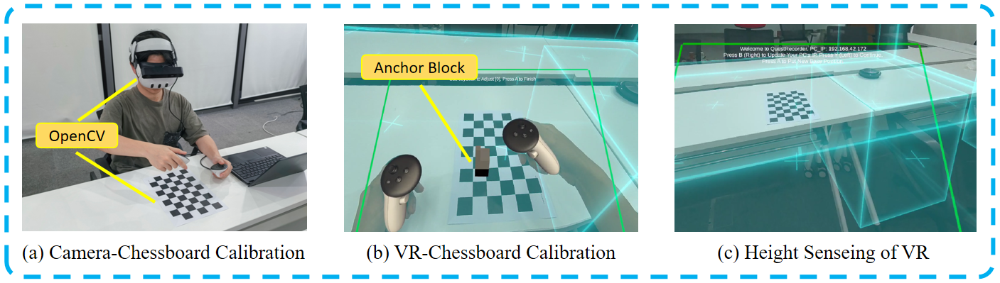

# MotionTrans: Human Data Collection


An example video is available at ``assets/media/examples/human_data_collection.mp4``

## Step0: Link ZED Camera with VR Headset
Hardware List:
 - ZED2 Camera  
 - Quest 3 VR Headset  
 - PC (for data receiving and saving)  

First, connect the ZED2 Camera to the PC. Then connect the ZED camera to the Quest 3 headset using a self-designed 3D-printed link. The design file is available at ``assets/Zed-V2.STL``. You can directly 3D print it through commercial 3D printing platforms such as [Bambu Studio](https://bambulab.com/zh/download/studio). Please ensure that the PC and VR headset are connected to the same local area network (LAN).  


## Step1: Install APP on VR Headset

First, download the Meta Quest APP from [MotionTrans_QuestRecorder_Unity.zip](https://drive.google.com/file/d/1OsbDZM-4SVGljROW6m_gB1LQDtPTXu0d/view?usp=sharing). The unzipped folder contains both the APK file and the source code (for those who want to modify the app for their own purposes).  

You can either install the APK file directly or build the app in Unity and install it on your Quest 3. For installation, [ARCap](https://github.com/Ericcsr/ARCap) provides a good tutorial for reference.  

## Step2: Start APP in VR Headset

Start the ``QuestRecorder`` APP in the VR headset. Then follow the instructions in the APP to start data collection:  
- First, press **B** to enter the IP address of the PC (used to receive and save the data) into the VR headset. We found that when the headset is in power-saving mode, the virtual keyboard may not appear. Therefore, please **disable power-saving mode in the Quest 3 settings**.  
- Then press **Y** to enter collection mode.  

We have pre-calibrated the transformation from the headset to the ZED camera, which is provided in ``camera_params``. If you want to calibrate another camera, please refer to the calibration chapter below.  


## Step3: Start Program on PC

Run the following command on the PC to start the data receiving and saving process:
```
bash scripts/mocap.sh
```

You can adjust the data saving path, camera exposure, and other parameters in the bash script. **If everything goes well, the PC should continuously receive "Wait Signal" from the VR at this point.**


## Step4: Start Human Data Collection !

The loop of human data collection is similar to robot teleoperation, as illustrated in the figure below:


- **(1) [Waiting State]**: Data will not be recorded.  
- **(2) [Collection State]**: The movements of the head and **both hands** (wrist pose, hand keypoints) are recorded.  
- **(3) [Ensuring State]**: You can use gestures to choose whether to save or delete the data just collected.  

The definition of hand keypoints could be found in this [link](https://docs.unity3d.com/Packages/com.unity.xr.hands@1.1/manual/hand-data/xr-hand-data-model.html). The details of XRHand Class in our codebase can also be found in ``human_data/models.py``.

**IMPORTANT**: We found that there is a delay when starting the collection (mainly because the ZED2 requires time to begin recording). This may lead to skipped data at the beginning of each collection. Therefore, we recommend **keeping still for 2 seconds at the beginning of each trajectory collection** to avoid this problem. The (nearly) still part will be removed during the data processing stage.  

We also recommend following the principles outlined in the main paper for human data collection to achieve better human-to-robot motion transfer performance.  


## Step5: The Format of Human Data

The collected data will be saved in the path specified in the bash script. The data format is as follows:

```
├── device_id.txt    # the device id of ZED camera
├── episode.pkl      # the human state data
├── recording.svo2   # the visual data
├── rgb.mp4          # a video for data checking
├── frame_grasp.txt  # the frame index (svo2) when hand grasping happens
├── frame_cut.txt    # the frame index (svo2) when the task is finished
```

The files `frame_grasp.txt` and `frame_cut.txt` are annotated manually after data collection.
These files are optional and only provided for few tasks where: (1) the definition of the task’s endpoint is ambiguous, or (2) the hand information recorded by VR is too noisy due to occlusion.

We recommend naming the folder for each task as `human_{env_type}_{task_description}`, where `{task_description}` is a short description of the task with all blank spaces replaced by underscores. For example, `pick_up_the_apple`.

## Step6: Calibrate Your Own Camera



The detailed theory and process of calibration can be found in the paper. Please refer to it for a better understanding. Here we provide step-by-step instructions.

First, print the checkerboard (`human_data/calib.io_checker_270x180_6x9_30.pdf`) on standard A4 paper. Then follow the steps below to complete the calibration:

**(1) VR Height Sensing:**  
Scan the room using the default Meta Quest Spatial Perception. Adjust the position of the fitting plane to ensure it aligns well with the height of the checkerboard/table.  

**(2) Camera–Chessboard Calibration:**  
Run the following command:  
```
python -m scripts_data.vr_calibration_device_data_collection -- ${camera_name} --checkboard_h 8 --checkboard_w 5 --square_size 30 -n 1
```
Follow the prompts of the running program to save the data for calibration. The data will be stored in the `camera_params/quest_${camera_name}` folder.  

**(3) Anchor Quest to Chessboard:**  
After completing step (2), the program will automatically switch to the VR–Chessboard calibration step. **Do not move your head during the entire process.** Pick up the VR controllers and press **A** to enter block placement mode. Use the joystick to adjust the position of the anchor block’s lower-left corner to match a chosen corner of the chessboard (**remember which corner you select**). Press **A** again to confirm the position. The PC will automatically receive the pose of the anchor block.  

**(4) Calculate the Transformation:**  
After completing steps (2) and (3), run the following command to calculate the transformation from VR to the camera:  
```
python -m scripts_data.vr_calibration_device_result_calculation -i camera_intrinsic.npy -b ${corner_idx} --resolution_resize 1280x720 --resolution_crop 640x480
```

Here, `${corner_idx}` is the index of the corner chosen in step (3). If the corner order is not from lower-left to upper-right, you should also add the ``--camera_bp3d_reverse`` parameter to the command. After running, the transformation will be automatically saved in ``calib_result_quest2camera.npy``.  

The program will also generate parameters to set the camera capture range feedback in VR, saved in ``calib_mount_solution.json``. Press **B** in VR to enter this value into the app. The resize and crop resolution parameters in the command can also be modified to match your own setup.  
