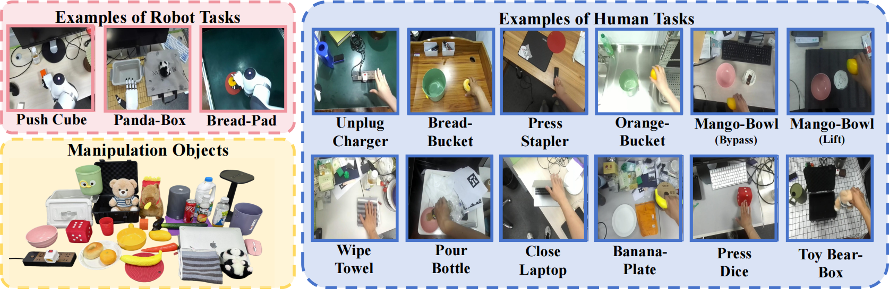
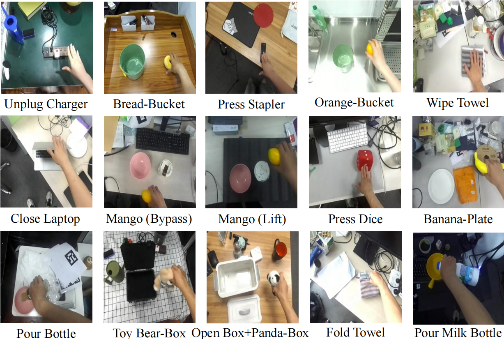
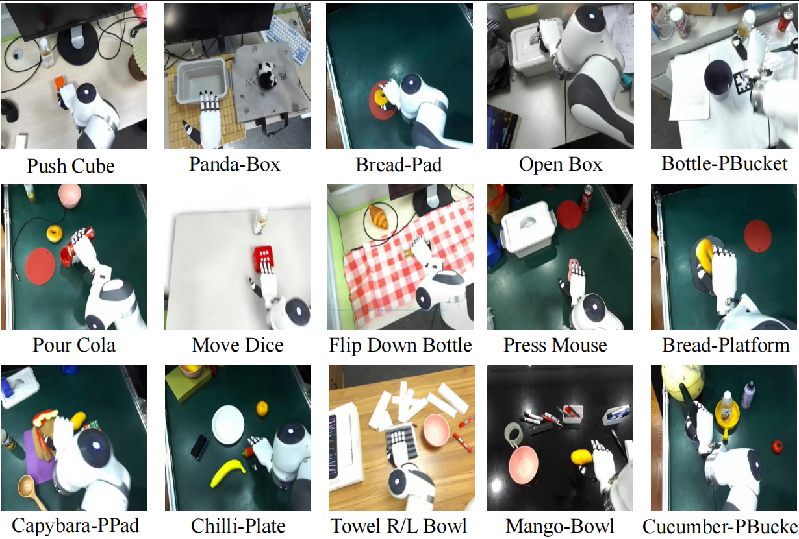

# MotionTrans Dataset

**[[MotionTrans Dataset Huggingface Link]](https://huggingface.co/datasets/michaelyuanqwq/motiontrans)**



## Download

**Please download the dataset from this huggingface link: [MotionTrans Dataset](https://huggingface.co/datasets/michaelyuanqwq/motiontrans).**

## Introduction
MotionTrans is the first framework to achieve explicit end-to-end human-to-robot motion transfer, enabling motion-level policy learning directly from human data. This repository contains the MotionTrans Dataset used in our paper, including zero-shot human-robot cotraining data and finetuning data. The dataset provides 15 human tasks and 15 robot tasks (a total of 3,213 demonstrations) for cotraining. For the 13 evaluated human tasks, we also provide 20 finetuning robot demonstrations for each task. To ensure visual background diversity, the dataset was collected across more than 10 different scenes.


## Folder Structure
```
motiontrans_dataset/
├── README.md                 # this file
├── motiontrans_dataset/        
│   ├── raw_data_human/       # cotraining human data (human tasks)
│   ├── raw_data_robot/       # cotraining robot data (robot tasks)
│   ├── raw_data_finetune/    # finetuning robot data (human tasks)
```

Each raw_data folder contains multiple subfolders, with each subfolder corresponding to a specific task. The naming format is: `{embodiment}_{env_type}_{task_description}`.

 - embodiment: `human` or `robot`
 - env_type: `se`, `me` or `mix`, where `se` means single scene; `me` multiple scenes each stored in a separate folder; and `mix` multiple scenes, all stored in the same folder.
  - task_description: short description of the task, with spaces replaced by underscores.

**For data processing code, please refer to the [MotionTrans Code Repository](../README.md).**

## Human Data Format

The human data format is as follows:

```
├── device_id.txt    # the device id of ZED camera
├── episode.pkl      # the human state data
├── recording.svo2   # the visual data
├── rgb.mp4          # a video for data checking
├── frame_grasp.txt  # the frame index (svo2) when hand grasping happens
├── frame_cut.txt    # the frame index (svo2) when the task is finished
```

The files `frame_grasp.txt` and `frame_cut.txt` are optional and only provided for few tasks where: (1) the definition of the task’s endpoint is ambiguous, or (2) the hand information recorded by VR is too noisy due to occlusion.

## Robot Data Format

The robot data format is as follows:

```
├── videos
│   ├── rgb.mp4             # a video for data checking
│   ├── recording.svo2      # the visual data
├── episode_config.yaml     # the configuration of this episode
├── episode.pkl             # the robot state data
```

## Task Lists

Human Tasks:



Robot Tasks:

